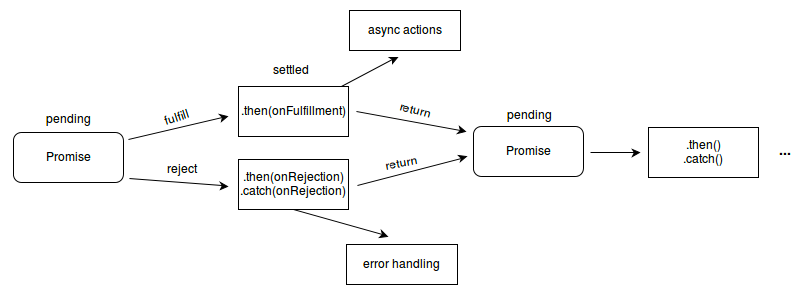

# 학습 정리

#### 개발 환경
* nodeJS
* IDE : webstorm
* bundler : parcel
* css library : tailwindcss, font-awesome

---
#### 데이터 유형 정의의 중요성
데이터 유형의 설명이 명확하지 않다면, 변경할 데이터를 검증을 위해서 문서, 확인사항이 많습니다.  만약에 확인을 했지만 그 정보가 정확하지 않을 경우도 있습니다.
> 코드 자체의 데이터 유형을 잘 설명할 수 있도록 정의 하는게 중요합니다.

#### 해커뉴스 앱 만드는 이유 
입력데이터(input)가 다양하고 많을 수 있고 출력하는 형식(output)이 많일 수 있겠지만,
"입력을 출력으로 바꾸는 것"을 이해 하기 위해 입니다.

#### 라우터
> 사용자가 노출될 화면 전환을 중계해준다.

## 타입스크립트

#### 환경 설정 
```json
{
    "compilerOptions": {
      "strict": true,
      "module": "commonjs",
      "target": "es5",
      "sourceMap": true,
      "alwaysStrict": true,
      "noImplicitAny": true
    },
    "exclude": [
      "node_modules"
    ]
}
```

#### type alias(타입 별칭)
``` ts
type Store = {
  currentPage: number;
  feeds: NewsFeed[];
} 
```


#### type, interface 타입결합 하는 방식이 틀리다.
* 교차타입 사용때 유니언 타입(Union Types)을 사용합니다. 이럴때 interface 지원을 안하기 때문에 type 사용합니다.

```
type NewsComment = News & {
  comments: NewsComment[];
  level: number;
}

interface NewsComment extends News {
  comments: NewsComment[];
  level: number;
}
```

readonly : 사용하면 값을 변경못하고 읽기만 가능하다.

#### modules
import/export 이용해서 캡슐화를 진행합니다.

#### 안전한 전역상태 관리
> 모두가 가능한 전역상태는 전역 공간은 가능하면 쓰지않는 것이 좋습니다.

#### 비동기
>Promise : 실행 코드가 완료될때까지 순차적으로 기달리는게 아니라, 다음 코드를 수행하는 것
* 대기(pending): 이행하거나 거부되지 않은 초기 상태.
* 이행(fulfilled): 연산이 성공적으로 완료됨.
* 거부(rejected): 연산이 실패함.


출처 : https://developer.mozilla.org/ko/docs/Web/JavaScript/Reference/Global_Objects/Promise

async/await : axios 사용하기 전에 Promise 숙지하고 사용하는걸 권장합니다.

---
# Basics
#### TypeScript 자료형
* Boolean (불리언)
* Number
* String
* Array
* Tuple (튜플)
* Enum (열거)
* Any
* Void
* Null and Undefined
* Never
* Object (객체)

#### javascript, typescript 비교
> 사용자가 사용하는 "런타임"아닌 개발자가 "컴파일 타임"시점에 타입을 확인하는 것, 타입스크립트의 장점입니다.

```javascript
// javascript
function addAge(age) {
  return age + 1;
}

let age = addAge('30');

console.log(age); // 301
```
```typescript
// typescript
function addAge(age: number): number {
  return age + 1;
}

let age: number = addAge('30'); // type error

console.log(age);
```


#### 비교연산자
```javascript
if(a == b) {}; // 동등연산자, 추상적(abstract)
if(a === b) {}; // 일치연산자, 엄격한(strict)
```
#### ES6 문법
```javascript
// 구조분해 할당
const colors = ['red', 'yellow', 'black'];
const colorsObj = {
  blue: 'blue',
  green: 'green',
  white: 'white'
}
const [red, yellow, black] = colors;
const { green, blue } = colorsObj;
```
---
### _6_
#### interface (인터페이스)
```typescript
interface UserInfo {
  name: string;
  age: number;
}

function setUserInfo(userInfo: UserInfo) {
    console.log(userInfo.name);
}

let myInfoObj = { name: 'jetty', age: 100 };

setUserInfo(myInfoObj);
```


#### Type Alias (타입 별칭)
```typescript
type UserInfo = {
  name: string,
  age?: number
}

// 빈 객체를 Person 타입으로 지정
const userInfo = {} as UserInfo;
userInfo.name = 'yang';
userInfo.age = 3000;
userInfo.address = 'Seoul'; // Error
```


#### 객체 타입을 규격화
```typescript
export interface IOnlyNumberValueObject {
  [key: string]: number;
}

export interface IGetApi {
  (url: string, search?: string): Promise<string>;
}
```


#### 선택적 프로퍼티 (Optional Properties)
```typescript
interface UserInfo {
  name: string;
  age: number;
  address?: string;
}
```
>  address? 물음표(Optional Properties)는 값은 필수값은 아니지만, 만약에 값이 있는 경우에는 정의된 타입과 일치해야합니다.
---
### _7_
#### 함수 호출 방식
```typescript
// 예제는 context는 null 선언했습니다.
myFn();
myFn.call(null, 1, 2, 3);    // 전달인자: 일반 값
myFn.apply(null, [1, 2, 3]); // 전달인자: 배열 값
```
* call(), apply() 공통적으로 context 객체가 존재합니다.


#### 화살표 함수 (arrow function) - "한 줄 함수"라고도 불립니다.
```typescript
const a = () => 100;
const b = x => x * 100;
const c = (x, y, z) => {
  y + x * z
};
```


#### 제너레이터 (generator)
```typescript
function* foo() {
  yield 10;
  yield 20;
  return 30;
}

const gen = foo();

gen.next();
gen.next();
gen.next();
```
---
### _8_
#### 인자로 전달되는 함수
> 함수형 프로그래밍 : 기능 요청 시 동일한 기능을 항상 출력해서 반환합니다.
```typescript
function ul(child: string): string {
  return `<ul>${child}</ul>`;
}
function ol(child: string): string {
  return `<ul>${child}</ul>`;
}

// start
function makeLI(
  container: (child: string) => string,
  contents: string[]
): string {
  const liList = [];

  // 1. li 태크 생성
  for (const content of contents) {
    liList.push(`<li>${content}</li>`);
  }
  // 2. container(ul, ol) 추가
  return container(liList.join(''));
}

// 3. 값 할당
const htmlUL = makeLI(ul, ['월', '화','수', '목', '금', '토', '일']);
const htmlOL = makeLI(ol, ['봄', '여룸', '가울', '겨울']);

// end
console.log(htmlUL);
```
---
### _14_
#### 비동기
> axios : Promise 기반으로 됩니다.
* promise : ES6 에서 비동기 처리를 위해 사용되는 객체입니다.
```typescript
function test() {};

async function foo() {
  try {
    const result = await test();
  } catch (e) {
    console.log("ERROR : "+e);
  } finally {
    console.log("finally");
  }
}
```
---
### _16_
#### 데이터의 객체 (date Object)

```typescript
type Box = {
  width: number;
  height: numberl
  borderRadius: number;
  borderWidth?: string;
  backgroundColor: string;
  color?: string;
  ['className']?: string;
}

// 객체 리터럴
let box: Box = {
  width: 200,
  height: 200,
  borderRadius: 10,
  backgroundColor: 'red'
};

// 함수로 객체 생성
function makeBox(
  width: number,
  height: number,
  borderRadius: number,
  backgroundColor: string
): Box {
  return {
    width,
    height,
    borderRadius,
    backgroundColor
  };
}
makeBox(100, 100, 10, 'red');

// 클래스로 객채 생성
class Shape implements Box { // type Box
  width: number;
  height: number;
  borderRadius: number;
  backgroundColor: string;
  
  constructor(
    width: number,
    height: number,
    borderRadius: number,
    backgroundColor: string
  ) {
    this.width = width;
    this.height = height;
    this.borderRadius = borderRadius;
    this.backgroundColor = backgroundColor;
  }
}
const boxShape = new Shape(10, 10, 5, 'red');

// 클래스의 규격을 파악하는 방법
if(boxShape instanceof Shape) {
  
};

box.borderRadius = 10;
box.color = 'blue';
box['className'] = 'boxName';

// 객체 변형
// 1 assign(n, box) : n에서 box를 추가합니다.
const box1 = box;
const box11 = Object.assign({}, box);

// 2 ... 전개 연산자(Spread Operator)를 이용해서, color를 추가합니다..
const box2 = { ...box, color: 'red' };

// 3 파싱 진행해서 변형 (문자열 > 객체)
const box3 = JSON.parse(JSON.stringify(box));
```
* 보통 전개 연산자(Spread Operator)을 사용합니다.
---
### _18_
#### array (배열)
```typescript
const books = [];
books[0] = '원피스';

// 추가
books.push('루피');
books.push('조로');
books.push('상디');
books.push('프랑키');

// 맨 뒷에 데이터(프랑키) 빠진다.
books.pop();

// 데이터 자르기
books.slice(1, 2); // 루피만 빠진다.

// 데이터를 빠지고 추가합니다.
books.splice(1, 2, '나미', '쵸파'); 

// 0번째 데이터 빠진다.
books.shift();

// 맨 앞에 데이터를 추가한다.
books.unshift('드래곤볼');

// 배열은 하나의 문자열로 합친다.
const booksJoin = books.join() // 기본옵션 : , (콤마)

// , 이용해서 배열을 만듭니다.
booksJoin.split(',') 

// 배열들끼리 합치는 방식
const book1 = [1];
const book2 = [2, 3]
book1.concat(book2); // [1, 2, 3], 배열 순서 : book1 + book2

// 전개 연산자 이용
const nextBookList = [...book1, ...book2];
```
---
### _19_
#### 배열 연산
##### forEach(), map(), filter()
```typescript
type Book = {
  title: string;
  copyrigth?: string;
  author?: string;
}
const books: string[] = [
  '원피스',
  '드래곤볼'
];
// 1 forEach()
books.forEach((book: string, index: number) => {
  console.log(book, index);
});


// 2-1 map() : 입력값을 map()을 이용해서, 데이터를 받아서 다른 형태(객채)로 변환하는데 자주 사용합니다.
const bookOjbects: Book[] = books.map((book: string) => {
  // 객채를 전달
  const result = {title: book, author: undefined};
  return result;
})
console.log(bookOjbects);

// 2-2 map & map
const ShakespeareOneBooks: Book[] = books
  .map((book: string) => ({
    title: book
  }))
  .map((book: Book) => ({
    ...book,
    author: undefined
  }))

console.log(ShakespeareOneBooks);


// 3-1 응용 방식 (재사용성)
const bookTitleToBookObject = (book: string) => ({title: book});

// 3-2 커링 기법 (6장_일급 함수)
const makeAuthor = (name: string) => (book: Book) => ({
  ...book,
  author: name
})

const shakespeareOneBooks2: Book[] = books
  .map(bookTitleToBookObject)
  .map(makeAuthor('베르세르크'));

console.log(shakespeareOneBooks2);


// 4. filter() : 특정 키값인해 필터링같은 방식으로 사용합니다.
const one: Book[] = shakespeareOneBooks2.filter((book: Book) =>
  book.title.includes('원'); // 원으로 시작하는 값을 찾습니다.
)
console.log(one);


// 5-1. reduce() : 배열[n] 안에 있는 합산
const someNumbers: number[] = [100, 20, 1, 2];
const sumNumber = someNumbers.reduce((a: number, b: number) => a + b, 0);
console.log(sumNumber); // 123

type SomeObject = {
  [key: string]: string | number;
}

const someObjects: SomeObject[] = [
  { border: "none"},
  { fontSize: 24},
  { className: 'box sm-box'}
]

// 5-2 객체들도 합산 가능합니다.
const someObject: SomeObject = someObjects.reduce(
  (a: SomeObject, b: SomeObject) => ({...a, ...b}),
  {}
);

console.log(someObject); // border + fontSize + className

// 5-3 가변인자 응용 : ...ages
function sumNumbersForTypeScript(...ages: number[]): number {
  return ages.reduce((a: number, b: number) => a + b, 0);
}

console.log(sumNumbersForTypeScript(100, 20, 1)) // 121
```
---
### _20_
#### Tuple (튜플)

```typescript
// 배열안에 각각 원소(인자)의 타입을 규정한 테이터 타입
const address: [number, string, string] = [123, '서울시', '송파구'];

type BookInfo = [string, string, number];

const BooksData: BookInfo[] = [
  ['루피', '원피스', 1000],
  ['루피', '원피스', 1000]
];

BooksData.push([1, 'B', 30]); // 1번째 인자는 type error

type Address = [number, string, string];
function getArray(): Address {
  return [123, '서울', '송파구'];
}
```
### _21_
#### class
> 객체를 정교하게 생성하는 방식, ES6 이후 클래스 문법이 추가됬습니다.

```typescript
interface Container {
  tagName: string;
  className: string;
  children?: string[];
  getTageName: () => string;
  getClassName: () => string;
}

// 상위 클래스
class Shape {
  // static : 정적 데이터
  public static MIN_WIDTH = 0;
  public static MAX_WIDTH = 100;

  // readonly : 읽기만 가능, 외부에서 변경 불가
  public readonly name: string = 'Shape';
  
  // protected : class안에 자식 클래스까지만 허용니다.
  protected _borderWidth: string;
  
  // private : 클래스(Shape)에서만 허용합니다.
  private action: string;

  constructor(borderWidth: number = 0) {
    this._borderWidth = borderWidth;
  }

  // abstract : 추상 클래스, 현재는 클래스는 정의만 되있습니다.
  abstract area: () => number;

  set borderWidth(width: number) {
    if (width >= Shape.MIN_WIDTH && width <= Shape.MAX_WIDTH) {
      this._borderWidth = width;
    } else {
      throw new Error('실패!');
    }
  }

  get borderWidth(): number {
    return this._borderWidth;
  }
}

// 하위 클래스
class Circle extends Shape { // 상속
  // private : 내부의 값은 보호합니다.
  private _radius: number;
  // 부모의 값을 재정의 가능합니다. (override)
  public readonly name: string = 'Circle';

  constructor(radius: number) {
    super(); // Shape(부모 호출) 초기화합니다.
    this._radius = radius;
  }

  get radius() {
    return this._radius;
  }

  // 부모에 선언한 추상 클래스의 실제 구현부입니다.
  area = () => this._radius * this._radius * Math.PI;
}

// 하위 클래스
class Rect extends Shape {
  private _width: number;
  private _heigth: number;
  public readonly name: string = 'Rect';

  constructor(width: number, height) {
    super(); // Shape(부모 호출) 초기화합니다.

    this._width = widths;
    this._heigth = height;
  }

  get width() {
    return this._width;
  }

  get height() {
    return this._heigth;
  }

  // 부모에 선언한 추상 클래스의 실제 구현부입니다.
  area = () => this._width * this._heigth;
}

const circle = new Circle(100);
const rect = new Rect(200, 100);

// 인터페이스를 이용해서 제공되면, 클래스 만드는 걸 도와줍니다.
// public만을 제공합니다. 참고로 private, protected 제공되지않고 class에서만 제공됩니다.
class MyContainer implements Container {
  tagName: string;
  className: string;

  constructor(tageName: string, className: string) {
    this.tagName = tageName;
    this.className = className;
  }
  
  getTageName = () => this.tagName;
  getClassName = () => this.className;
}
```
### _22_
#### instance (인스턴스)
```typescript

```